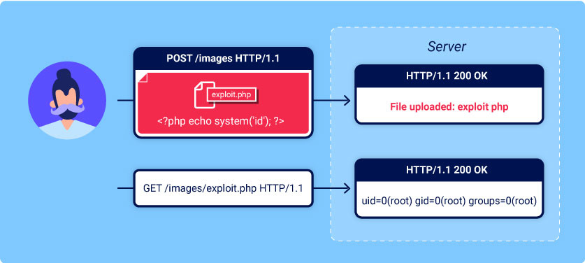

# File Upload


## ¿En que consiste la vulnerabilidad?

Hablamos de vulnerabilidades File Upload cuando un servidor web permite a los usuarios cargar archivos en su sistema sin realizar validaciones suficientes como son su nombre, tipo, contenido o tamaño. No hacer cumplir adecuadamente estas restricciones  podría significar que incluso una función básica de carga de imágenes se puede utilizar para cargar archivos arbitrarios y potencialmente peligrosos en su lugar. Esto podría incluso incluir archivos de script del lado del servidor que permiten la ejecución remota de código.



## ¿Que impacto pueden tener?

El impacto de las vulnerabilidades de carga de archivos generalmente depende de dos factores clave:

- Qué aspecto del archivo el sitio web no valida correctamente, ya sea su tamaño, tipo, contenido, etc.
- Qué restricciones se imponen al archivo una vez que se ha cargado correctamente.

En el peor de los casos, el tipo de archivo no se valida correctamente y la configuración del servidor permite que ciertos tipo de archivo  se ejecuten como código. En este caso, un atacante podría cargar un archivo de código del lado del servidor que funcione como un Shell web, otorgándole efectivamente un control total sobre el servidor. .php .js

Un ejemplo de código que puede aprovechar este tipo de vulnerabilidad seria el siguiente:

```php
<?php echo system($_GET['command']); ?>
```

Con esta linea de PHP podemos ejecutar codigo de forma remota en el servidor desde el navegador web de nuestro propio equipo 

```html
GET /Uploads/exploit.php?command=id HTTP/1.1
```

Si el nombre de archivo no se valida correctamente, esto podría permitir a un atacante sobrescribir archivos críticos simplemente cargando un archivo con el mismo nombre. Si el servidor también es vulnerable al File Path Traversal, esto podría significar que los atacantes incluso pueden cargar archivos en ubicaciones imprevistas.

No asegurarse de que el tamaño del archivo se encuentre dentro de los umbrales esperados también podría habilitar una forma de ataque de denegación de servicio (DoS), mediante el cual el atacante llena el espacio disponible en disco.

## Tipos de archivos maliciosos

Para evaluar y saber exactamente qué controles implementar, saber a qué se enfrenta es esencial para proteger nuestra web. Es por ello que vamos a ver alguno de los tipos de archivos maliciosos mas comunes.

### Archivos maliciosos

1. Explotar vulnerabilidades en el analizador de archivos o en el módulo de procesamiento (por *ejemplo,* [ImageTrick Exploit](https://imagetragick.com/), [XXE](https://owasp.org/www-community/vulnerabilities/XML_External_Entity_(XXE)_Processing))
2. Usar el archivo para phishing 
3. Envíe bombas ZIP, bombas XML (también conocidas como zip de la muerte) o simplemente archivos enormes para llenar el almacenamiento del servidor que dificulta y daña la disponibilidad del servidor
4. Sobrescribir un archivo existente en el sistema
5. Contenido activo del lado del cliente (XSS, CSRF, etc.) que podría poner en peligro a otros usuarios si los archivos son accesibles de forma publica.

## Implementaciones seguras

- Lista de extensiones permitidas. Permitir solo extensiones seguras y críticas para la funcionalidad del sitio web
  - Asegurarnos de que se aplica la Validación de entrada antes de validar las extensiones.
- Validar el tipo de archivo, no confíe en el encabezado o content-type, ya que puede ser falsificado
- Cambiar el nombre de archivo por una cadena generada por la aplicación
- Establecer un límite de longitud de nombre de archivo. Restrinjir los caracteres permitidos si es posible
- Establecer un límite de tamaño de archivo
- Permitir solo que los usuarios autorizados carguen archivos*
- Almacene los archivos en un servidor diferente. Si eso no es posible, guárdelos fuera de la raíz web
  - En el caso del acceso público a los archivos, use un controlador que se asigne a los nombres de archivo dentro de la aplicación (someid -> file.ext)
- Ejecute el archivo a través de un antivirus o un entorno limitado si está disponible para validar que no contiene datos maliciosos
- Asegúrese de que todas las bibliotecas utilizadas estén configuradas de forma segura y actualizadas
- Proteger la carga de archivos de ataques CSRF

### Lista negra insuficiente 

Una de las formas más obvias de evitar que los usuarios carguen scripts maliciosos es incluir en la lista negra extensiones de archivo potencialmente peligrosas como php o js. La práctica de las listas negras es inherentemente defectuosa, ya que es difícil bloquear explícitamente todas las extensiones de archivo posibles que podrían usarse para ejecutar código. Estas listas negras a veces se pueden omitir mediante el uso de extensiones de archivo alternativas menos conocidas que aún pueden ser ejecutables, como .php5 o.shtml .

#### Cambiando la configuración del servidor

Los servidores normalmente no ejecutarán archivos a menos que se hayan configurado para hacerlo. Por ejemplo, antes de que un servidor Apache ejecute archivos PHP solicitados por un cliente, es posible que los desarrolladores tengan que agregar las siguientes directivas a su archivo: `/etc/apache2/apache2.conf`

```
LoadModule php_module /usr/lib/apache2/modules/libphp.so AddType application/x-httpd-php .php
```

Muchos servidores también permiten  crear archivos de configuración especiales dentro de directorios individuales para anular o agregar configuraciones concretas a parte de las globales. Los servidores Apache, por ejemplo, cargarán una configuración específica del directorio desde un archivo llamado`.htaccess`.

Los servidores web usan este tipo de archivos de configuración cuando están presentes, pero normalmente no se les permite acceder a ellos mediante solicitudes HTTP. Sin embargo, ocasionalmente puede encontrar servidores que no impiden cargar su propio archivo de configuración malintencionado.
