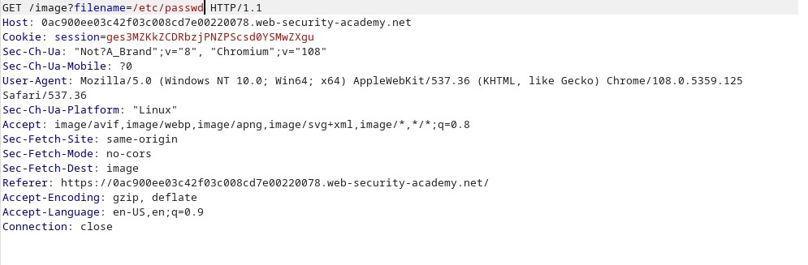

# Nada de seguridad
Para empezar estos ataques los he realizado en la página de PortSwigger. Por lo qué al realizar el ataque solo aparece que el laboratorio esta solucionado y no muestra el contenido real que debería.

Estos ataques se han realizado utilizando PortSwigger
El 1º ataque realizado no tenía seguridad ninguna y se hace de la siguiente forma.

- Paramos la petición en BurpSuite 

- Y le añadimos la URL que queremos que recorra el servidor

Y ya estaría con esto nos debería de mostrar el contenido de /etc/passwd, pero en este caso no aparece nada

# URL absoluta
En el segundo ataque no podemos atacar de la siguiente forma, ya que el servidor bloquea las URLs relativas, por lo que hay que realizar el mismo ataque pero cambiando las URLs relativas a absolutas de la siguiente manera

- Paramos la petición en BurpSuite 

- Y le añadimos el PATH que queremos que recorra el servidor
